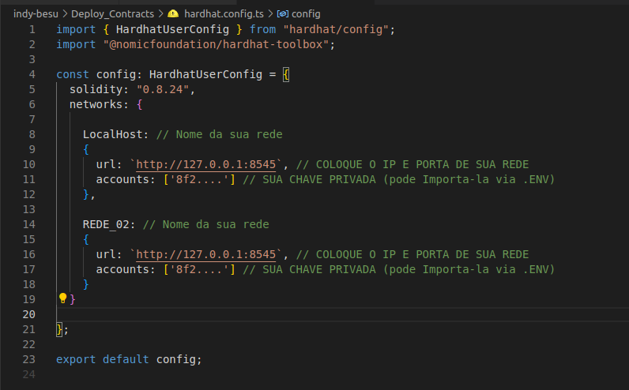
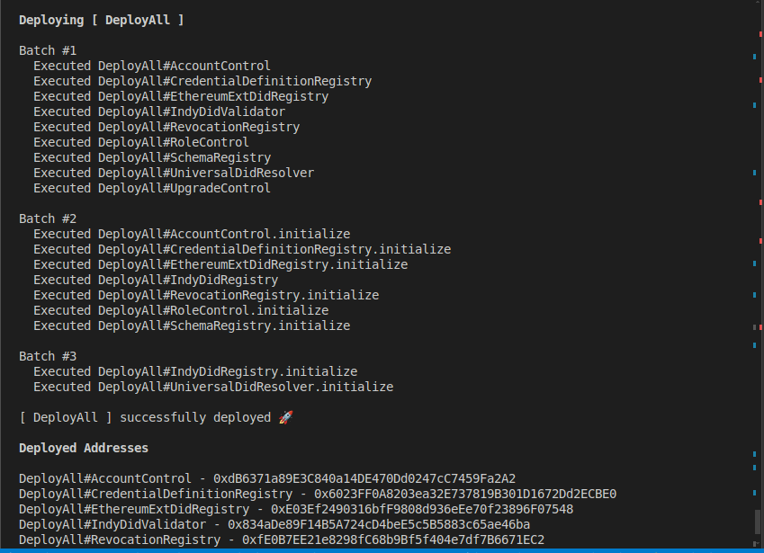

# Deploy e Inicialização de Contratos de Identidade Descentralizada 

Este projeto contém uma arquitetura completa baseada em contratos inteligentes para gerenciar identidades descentralizadas (DIDs), revogação de credenciais, registros de esquema e controle de acesso. A implantação é feita via Hardhat com suporte ao Ignition, permitindo deploy modular e inicialização automatizada.

## Requisitos

- Node.js v16+
- Hardhat
- npm


Antes de iniciar o deploy, certifique-se de configurar o arquivo hardhat.config.ts com os dados corretos da sua rede:
```
networks: {
  local: {
    url: "http://127.0.0.1:8545", // ou o endereço da sua rede
    accounts: ["SUA_CHAVE_PRIVADA"]
  }
}
```


## Instale as dependências e compile os contratos: 

```shell
npm install
npx hardhat compile
```


# Deploy e Inicializaçao de contratos 
Após configurar sua rede, você pode proceder com o deploy e a inicialização dos contratos. Aqui está uma breve descrição de cada contrato e o processo de inicialização:
 ## Contratos
- ### AccountControl:

  Função initialize: Configura o contrato com os endereços do RoleControl e do UpgradeControl. Essencial para definir as permissões e controles de acesso na sua aplicação.

- ### RoleControl:

   Função initialize: Inicializa o contrato com o endereço do UpgradeControl, configura as funções de confiança e roles. Este contrato gerencia a atribuição e verificação de roles dentro do sistema.

- ### CredentialDefinitionRegistry:

   Função initialize: Configura o contrato com os endereços do UpgradeControl, UniversalDidResolver e SchemaRegistry. É responsável por gerenciar as definições dos credenciais e suas relações com o esquema e o resolvedor DID.
- ### SchemaRegistry:

   Função initialize: Configura o contrato com os endereços do UpgradeControl e UniversalDidResolver. Gerencia os esquemas utilizados na aplicação.
- ### RevocationRegistry:

  Função initialize: Configura o contrato com os endereços do UpgradeControl, UniversalDidResolver e CredentialDefinitionRegistry. Gerencia a revogação de credenciais e suas relações com o resolvedor e o registro de definições de credenciais.
- ### EthereumExtDidRegistry:

  Função initialize: Configura o contrato com o endereço do UpgradeControl. Registra e gerencia os DIDs (identificadores descentralizados) na blockchain Ethereum.
- ### IndyDidRegistry:

  Função initialize: Configura o contrato com o endereço do UpgradeControl. Gerencia os DIDs em um sistema específico para identidades descentralizadas.
- ### UniversalDidResolver:

  Função initialize: Configura o contrato com os endereços do UpgradeControl, IndyDidRegistry e EthereumExtDidRegistry. Resolve e gerencia diferentes tipos de DIDs e suas associações.
- ### UpgradeControl:

  Função initialize: Configura o contrato com o endereço do RoleControl. Gerencia a atualização dos contratos e suas permissões.

## Executando o Deploy e Inicialização

 Rode o seguinte comando para realizar o deploy dos contratos e inicializá-los na rede:

```shell
npx hardhat ignition deploy ./ignition/modules/DeployAndInitializeContracts.ts --network local
```

## Endereços dos Contratos

Após a execução do comando, você verá os endereços dos contratos no terminal. Esses endereços são importantes para interagir com os contratos já implantados.


